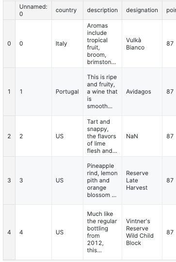
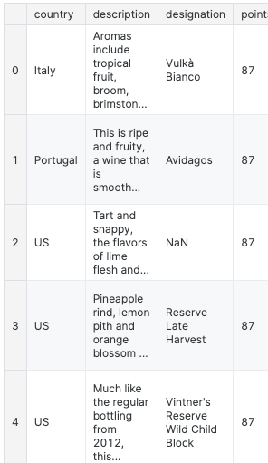

# Creating data
## Series
> pd.Series([1,2,3,4,5])

Output
```
0    1
1    2
2    3
3    4
4    5
```
-> We can use 'map'function to Series because there is no column name


```
pd.Series([30, 35, 40], index=['2015 Sales', '2016 Sales', '2017 Sales'], name='Product A')
```

⬇Output:

|||
| :--- | :--- |
|2015 Sales  |  30 |
|2016 Sales  |  35 |
|2017 Sales  |  40 |

Name: Product A, dtype: int64

# Reading data files
## CSV = comma separated value

e.g.
```
wine_review = pd.read_csv("../input/wine-reviews/---.csv")
```
We can see the shape
> wine_reviews.shape

> (129971, 14)
about 130000 records and 14 different columns

We can examine the contents of the first five rows
> wine_reviews.head()



The pd.read_csv() function is well-endowed, with over 30 optional parameters you can specify. For example, you can see in this dataset that the CSV file has a built-in index, which pandas did not pick up on automatically. To make pandas use that column for the index (instead of creating a new one from scratch), we can specify an index_col.

```
wine_reviews = pd.read_csv("../input/wine-reviews/winemag-data-130k-v2.csv", index_col=0)
wine_reviews.head()
```



# Exercise
https://www.kaggle.com/code/ponta1234/exercise-creating-reading-and-writing/edit


