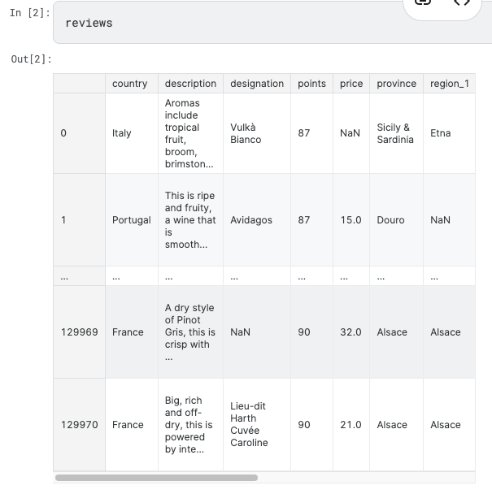
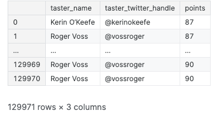

https://www.kaggle.com/code/residentmario/indexing-selecting-assigning

# Indexing, Selecting & Assigning

## Indexing in Pandas




### Index-based selection
`iloc`

```
reviews.iloc[0]
```
-> row 0 will be shown

- Both `loc` and `iloc` are `row-first, column-second`. 

- This is the opposite of what we do in native Python, which is `column-first`, `row-second`.


```
reviews.iloc[:, 0]
```
-> all rows & column 0


### Label-based selection
`loc`
```
reviews.loc[0, 'country']
```
--> 'Italy'

- iloc is conceptually simpler than loc because it ignores the dataset's indices. When we use iloc we treat the dataset like a big matrix (a list of lists), one that we have to index into by position. loc, by contrast, uses the information in the indices to do its work. Since your dataset usually has meaningful indices, it's usually easier to do things using loc instead. For example, here's one operation that's much easier using loc:

```
reviews.loc[:, ['taster_name', 'taster_twitter_handle', 'points']]
```

 

 - Choosing between loc and iloc¶
- When choosing or transitioning between loc and iloc, there is one "gotcha" worth keeping in mind, which is that the two methods use slightly different indexing schemes.

- iloc uses the Python stdlib indexing scheme, where the first element of the range is included and the last one excluded. So 0:10 will select entries 0,...,9. loc, meanwhile, indexes inclusively. So 0:10 will select entries 0,...,10.

- Why the change? Remember that loc can index any stdlib type: strings, for example. If we have a DataFrame with index values Apples, ..., Potatoes, ..., and we want to select "all the alphabetical fruit choices between Apples and Potatoes", then it's a lot more convenient to index df.loc['Apples':'Potatoes'] than it is to index something like df.loc['Apples', 'Potatoet'] (t coming after s in the alphabet).

- This is particularly confusing when the DataFrame index is a simple numerical list, e.g. 0,...,1000. In this case df.iloc[0:1000] will return 1000 entries, while df.loc[0:1000] return 1001 of them! To get 1000 elements using loc, you will need to go one lower and ask for df.loc[0:999].

- Otherwise, the semantics of using loc are the same as those for iloc.


### Manipulating the index


### Conditional selection¶


