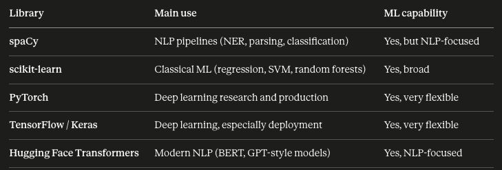

# Machine Learning

## Library


- spaCy is widely used in industry for production NLP pipelines because it is fast and opinionated. However, in NLP research and modern deep learning, Hugging Face Transformers has become the dominant library. Most state-of-the-art NLP work (like using BERT or GPT) is done with Hugging Face, not spaCy.
- Interestingly, spaCy and Hugging Face are not always competitors. You can plug Hugging Face models into a spaCy pipeline.


``` python
def train(model, train_data, optimizer, batch_size=8):
    losses = {}
    random.seed(1)
    random.shuffle(train_data)

    for batch in minibatch(train_data, size=batch_size):
        for text, labels in batch:
            doc = nlp.make_doc(text)
            example = Example.from_dict(doc, labels)
            nlp.update([example], sgd=optimizer, losses=losses)

    return losses

```
- sgd = stochastic gradient descent

  Setup                                                                                                                      
  - losses = {} — dict to track loss values per component (e.g., {"textcat": 0.5})
  - random.seed(1) + random.shuffle — shuffles training data reproducibly to reduce order bias                               
                                                                                                                           
  Training loop                                                                                                              
  - minibatch(train_data, size=batch_size) — splits data into chunks of 8 examples (spaCy utility)
  - nlp.make_doc(text) — tokenizes the raw text string into a spaCy Doc object                                               
  - Example.from_dict(doc, labels) — pairs the doc with its gold-standard labels (e.g., {"cats": {"POSITIVE": 1, "NEGATIVE": 
  0}})                                                                                                                       
  - nlp.update(...) — runs a forward pass, computes loss, and backpropagates to update model weights via the optimizer       
                                                                                                                             
  Return                                                                                                                     
  - Returns losses so the caller can monitor training progress (e.g., print loss per epoch)
                                                                                                                             
  The pattern is standard spaCy v3 training: tokenize → wrap as Example → update in batches.


