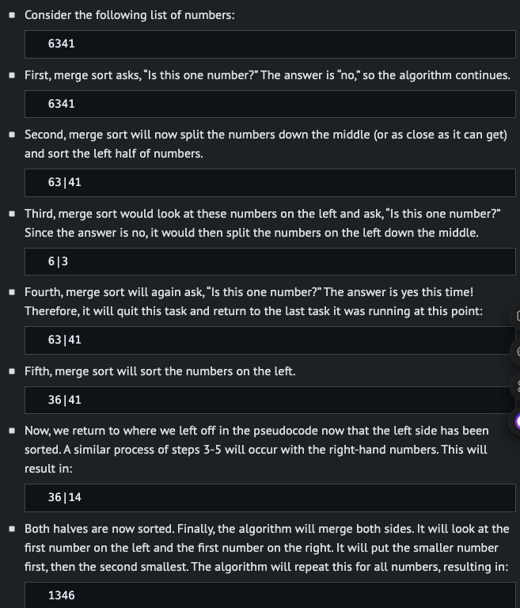
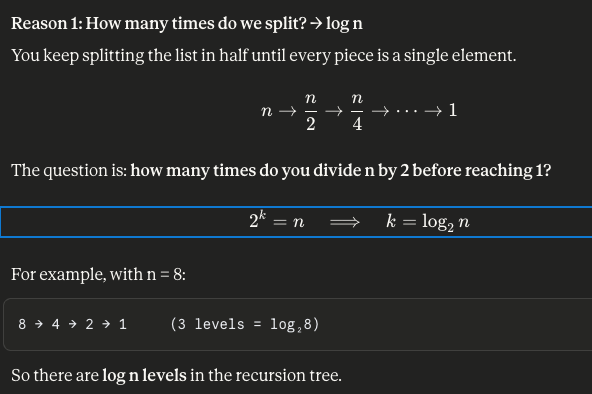
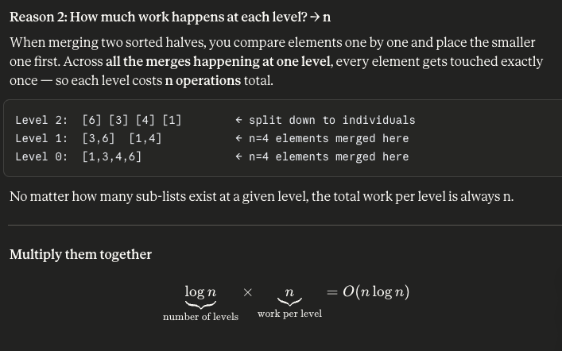

# Algorithm


## Struct

```


```


## Selection Sort

- algorithm
```
For i from 0 to n–1
    Find smallest number between numbers[i] and numbers[n-1]
    Swap smallest number with numbers[i]

```
- This could be simplified to n(n-1)/2 or, more simply, 𝑂⁡(𝑛2). In the worst case or upper bound, selection sort is in the order of 𝑂⁡(𝑛2). In the best case or lower bound, selection sort is in the order of Ω⁡(𝑛2).


## Bubble Sort
- Bubble sort is another sorting algorithm that works by repeatedly swapping elements to “bubble” larger elements to the end.
  
```
Repeat n-1 times
    For i from 0 to n–2
        If numbers[i] and numbers[i+1] out of order
            Swap them
    If no swaps
        Quit

```
- In the worst case or upper bound, bubble sort is in the order of 𝑂⁡(𝑛2). In the best case or lower bound, bubble sort is in the order of Ω⁡(𝑛).


## Recursion
- How could we improve our efficiency in our sorting?
- Recursion is a concept within programming where a function calls itself. 
```
// Draws a pyramid using iteration

#include <cs50.h>
#include <stdio.h>

void draw(int n);

int main(void)
{
    // Get height of pyramid
    int height = get_int("Height: ");

    // Draw pyramid
    draw(height);
}

void draw(int n)
{
    // Draw pyramid of height n
    for (int i = 0; i < n; i++)
    {
        for (int j = 0; j < i + 1; j++)
        {
            printf("#");
        }
        printf("\n");
    }
}
```

↓


```
// Draws a pyramid using recursion

#include <cs50.h>
#include <stdio.h>

void draw(int n);

int main(void)
{
    // Get height of pyramid
    int height = get_int("Height: ");

    // Draw pyramid
    draw(height);
}

void draw(int n)
{
    // If nothing to draw
    if (n <= 0)
    {
        return;
    }

    // Draw pyramid of height n - 1
    draw(n - 1);

    // Draw one more row of width n
    for (int i = 0; i < n; i++)
    {
        printf("#");
    }
    printf("\n");
}

```


## Merge Sort

- Use recursion


- The pseudocode for merge sort is quite short:
```
If only one number
    Quit
Else
    Sort left half of numbers
    Sort right half of numbers
    Merge sorted halves
```


- Merge sort is complete, and the program quits.
- Merge sort is a very efficient sort algorithm with a worst case of 𝑂⁡(𝑛⁢log⁡𝑛). The best case is still Ω⁡(𝑛⁢log⁡𝑛) because the algorithm still must visit each place in the list. Therefore, merge sort is also Θ⁡(𝑛⁢log⁡𝑛) since the best case and worst case are the same.






- Why the best case is also Ω(n log n)
- Even if the list is already sorted, merge sort has no way to detect that and stop early. It must split all the way down (log n levels) and must compare elements while merging (n per level). There is no shortcut, so best and worst case cost the same — making it Θ(n log n).