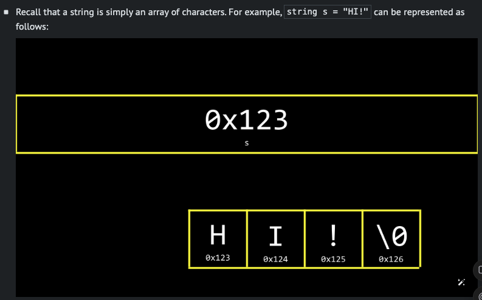
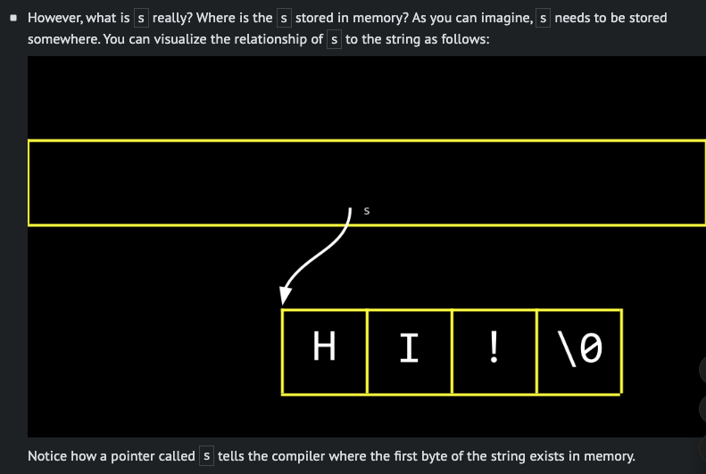
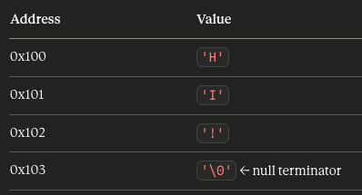

# Memory


## Pointers


- The C language has two powerful operators that relate to memory:

  - `&` Provides the address of something stored in memory.
  - `*` Instructs the compiler to go to a location in memory.


```
#include <stdio.h>

int main(void)
{
    int n = 50;
    printf("%p\n", &n);
}

```
Notice the `%p`, which allows us to view the address of a location in memory. `&n` can be literally translated as “the address of n.” Executing this code will return an address of memory beginning with 0x. 


## string

```
int main(void)
{
    string s = "HI!";
    printf("%s\n", s);
}
```






You can mnodify code
```
#include <cs50.h>
#include <stdio.h>

int main(void)
{
    string s = "HI!";
    printf("%s\n", s);
}
```

↓

```

#include <stdio.h>

int main(void)
{
    char *s = "HI!";
    printf("%s\n", s);
}
```

Because

What is char *?
To understand why a string is a char *, you need to know how strings are stored in memory.

"HI!" in memory looks like this:


char `*s` is a pointer — it stores the memory address of the first character. So `s` holds `0x100`, and C knows the string ends when it hits '\0'.
`printf("%s", s)` works by starting at that address and printing characters one by one until it finds '\0'.

